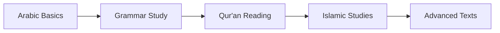

# 📚 QHub - Arabic & Qur'an Learning Hub

<div align="center">

[](https://github.com/farhadalam75/QHub/stargazers)
[](https://github.com/farhadalam75/QHub/network)
[](https://github.com/farhadalam75/QHub/issues)

**🌟 A centralized system to manage Arabic learning and Qur'an memorization projects**

*Including interactive tools, organized resources, and exercises to help learners track progress and improve*

</div>

---

## 📑 Table of Contents
- [🌟 Description](#-description)
- [🎯 Features](#-features)
- [📁 Repository Structure](#-repository-structure)
- [🔗 Quick Access Links](#-quick-access-links)
- [🚀 Getting Started](#-getting-started)
- [📊 Learning Paths](#-learning-paths)
- [🛠️ How to Use](#️-how-to-use)
- [🤝 Contributing](#-contributing)
- [📞 Support](#-support)

---

## 🌟 Description
A comprehensive educational repository designed for Islamic learning, featuring:
- **📖 Arabic Language Mastery**: From basic alphabet to advanced grammar
- **📿 Qur'an Study & Memorization**: Systematic approach to Hifz
- **🕌 Islamic Knowledge**: Hadith, Seerah, and Islamic sciences
- **📊 Progress Tracking**: Tools to monitor your learning journey
- **🎨 Visual Learning**: Charts, images, and interactive materials

---

## 🎯 Features
| Feature | Description |
|---------|-------------|
| 📖 **Arabic Learning** | Complete grammar guides, vocabulary builders, and pronunciation resources |
| 📿 **Qur'an Tools** | Memorization aids, Tajweed guides, and progress trackers |
| 🕌 **Islamic Studies** | Hadith collections, Duas, Prophet's biography, and Islamic sciences |
| 📊 **Progress Tracking** | Organized materials to monitor learning achievements |
| 🎨 **Visual Learning** | Images, charts, and infographics for effective learning |
| 🌍 **Multi-language** | Resources in Arabic, English, Bengali, and Urdu |

---

## 📁 Repository Structure

```
🏛️ QHub - Islamic Learning Hub
│
├── 🔤 Arabic/                     # Arabic Language Learning
│   ├── 📚 Books/                  # Comprehensive textbooks
│   │   ├── 🇧🇩 Bangla books/      # Bengali resources
│   │   ├── 📖 Dr V. Abdur Rahim/   # Madinah Arabic series
│   │   ├── 📘 Madina Book/        # Popular course materials
│   │   └── 🎯 حي على العربية/      # Living Arabic course
│   ├── 🎓 Courses/                # Structured programs
│   │   ├── 📋 Arabic101/          # Beginner course
│   │   └── 🕌 Islamic Education/   # Islamic studies
│   ├── 📝 Grammar/                # Detailed grammar
│   │   ├── 🔧 Nahw/              # Syntax rules
│   │   ├── 🎯 Verbs/             # Verb conjugation
│   │   │   ├── 🖼️ Images/         # Visual charts
│   │   │   └── 📄 Short pdf/      # Quick guides
│   │   └── 📖 Modern Grammar.pdf  # Contemporary approach
│   └── 📑 Short pdf/              # Quick references
│
├── 📖 Quran/                      # Qur'an Study & Memorization
│   ├── 📚 Books/                  # Translations & commentary
│   ├── 🧠 Memorization/           # Hifz tools
│   │   ├── 🤲 Dua/               # Supportive prayers
│   │   ├── 🖼️ Images/            # Visual aids
│   │   ├── 📝 Progress.txt        # Track memorized verses
│   │   └── 📷 Screenshots/        # Progress captures
│   ├── 📄 Short pdf/              # Concise materials
│   └── 🎵 Tajweed/               # Recitation rules
│
├── 🤲 Dua/                        # Supplications & Prayers
│
├── 📜 Hadith/                     # Prophetic Traditions
│   ├── 🖼️ Images/                # Visual hadith
│   ├── 🧠 Memorization/           # Memory aids
│   │   ├── 🖼️ Images/            # Visual helpers
│   │   ├── 📚 Pdfs/              # Study materials
│   │   └── 📷 Screenshots/        # Learning journey
│   └── 📄 Short pdf/              # Collections
│       ├── 📖 110 Hadith Qudsi    # Divine sayings
│       ├── 👶 30 Children Hadith  # Kids collection
│       └── ✨ Divine Hadiths      # Sacred traditions
│
├── 📖 Others/                     # Additional Resources
│   ├── 📚 Books/                  # Miscellaneous texts
│   │   ├── 🎓 Board books/        # Educational curriculum
│   │   └── 🔬 Ilm/               # Islamic sciences
│   └── 🔢 Visual aids            # Learning tools
│
└── 👤 Sirat/                      # Prophet's Biography
    ├── 📜 Biography texts         # Life stories
    └── 👥 Sahaba/                # Companion stories
```

---

## 🔗 Quick Access Links

<div align="center">

### 🎯 **Quick Navigation**
| Arabic | Qur'an | Islamic Studies | Resources |
|:------:|:------:|:---------------:|:---------:|
| [📚 Books](./Arabic/Books/) | [📖 Translations](./Quran/Books/) | [🤲 Duas](./Dua/) | [📖 Others](./Others/) |
| [🎓 Courses](./Arabic/Courses/) | [🧠 Memorization](./Quran/Memorization/) | [📜 Hadith](./Hadith/) | [👤 Sirat](./Sirat/) |
| [📝 Grammar](./Arabic/Grammar/) | [🎵 Tajweed](./Quran/Tajweed/) | [🕌 Education](./Arabic/Courses/Islamic%20Education/) | [🔬 Sciences](./Others/Books/Ilm/) |

</div>

---

### 🔤 **Arabic Learning Hub**

#### 📚 **Core Textbooks & References**
- **[🇧🇩 Bengali Resources](./Arabic/Books/Bangla%20books/)** - Arabic learning in Bengali language
- **[📖 Madinah Arabic Series](./Arabic/Books/Dr%20V.%20Abdur%20Rahim%20Madinah%20Arabic%20Reader/)** - Dr. V. Abdur Rahim's comprehensive course
- **[📘 Madina Book Collection](./Arabic/Books/Madina%20Book/)** - Popular Arabic learning materials
- **[🎯 Living Arabic Course](./Arabic/Books/%D8%AD%D9%8A%20%D8%B9%D9%84%D9%89%20%D8%A7%D9%84%D8%B9%D8%B1%D8%A8%D9%8A%D8%A9%20-%20NQA/)** - حي على العربية interactive materials

#### 🎓 **Structured Learning Programs**
- **[📋 Arabic 101](./Arabic/Courses/Arabic101/)** - Complete beginner course
- **[🕌 Islamic Education](./Arabic/Courses/Islamic%20Education/)** - Integrated Islamic studies

#### 📝 **Grammar & Language Structure**
- **[🔧 Nahw (Arabic Syntax)](./Arabic/Grammar/Nahw/)** - Sentence structure and rules
- **[🎯 Arabic Verbs Hub](./Arabic/Grammar/Verbs/)** - Complete verb conjugation system
  - **[🖼️ Visual Verb Charts](./Arabic/Grammar/Verbs/Images/)** - Conjugation tables and patterns
  - **[📄 Verb Quick Guides](./Arabic/Grammar/Verbs/Short%20pdf/)** - Downloadable references
- **[📖 Modern Arabic Grammar](./Arabic/Grammar/%E0%A6%86%E0%A6%A7%E0%A7%81%E0%A6%A8%E0%A6%BF%E0%A6%95%20%E0%A6%86%E0%A6%B0%E0%A6%AC%E0%A6%BF%20%E0%A6%AC%E0%A7%8D%E0%A6%AF%E0%A6%BE%E0%A6%95%E0%A6%B0%E0%A6%A8.pdf)** - Contemporary grammar guide

#### 📑 **Quick Reference Materials**
- **[🎮 Interactive Arabic](./Arabic/Short%20pdf/lets%20play%2020.pdf)** - Fun learning activities

---

### 📖 **Qur'an Study Center**

#### 📚 **Translations & Commentary**
- **[📖 The Clear Qur'an](./Quran/Books/The_Clear_Quran_A_Thematic_English_Translation_Allah_edition_--_Dr._Mustafa_Khattab_2017_BC2C0DDB.pdf)** - Dr. Mustafa Khattab's thematic translation
- **[📄 Mufti Taqi Usmani Translation](./Quran/Books/quran-english-translation-mufti-taqi-usmani.pdf)** - Scholarly English translation
- **[📋 30 Juz Overview](./Quran/Books/At%20a%20glance%20-%20summary%20of%20the%2030%20Juz%20of%20the%20blessed%20Quran.pdf)** - Complete Qur'an summary

#### 🧠 **Memorization (Hifz) Tools**
- **[📝 Progress Tracker](./Quran/Memorization/Memorized%20Verses.txt)** - Personal memorization log
- **[🤲 Memorization Duas](./Quran/Memorization/Dua/)** - Supportive supplications
- **[🖼️ Visual Memory Aids](./Quran/Memorization/Images/)** - Memorization helpers
- **[📷 Progress Documentation](./Quran/Memorization/Screenshots/)** - Journey captures

#### 📄 **Quick Study Materials**
- **[📖 Arabic Qur'an Text](./Quran/Short%20pdf/01-Quraan-e-Kareem-Arabic.pdf)** - Complete Arabic text
- **[📝 Vocabulary Builder](./Quran/Short%20pdf/04-PART-1-Quran-Words.pdf)** - Essential Qur'anic words
- **[🤲 Daily Recitation Guide](./Quran/Short%20pdf/Daily-Recitations.pdf)** - Regular practice schedule
- **[🌙 Surat Al-Mulk](./Quran/Short%20pdf/SuratMulkOnePageHiRes.pdf)** - High-resolution single page

#### 🎵 **Tajweed & Recitation**
- **[📚 Advanced Tajweed Guide](./Quran/Tajweed/Advanced-Tajweed-Book.pdf)** - Comprehensive rules
- **[📖 Detailed Rules Manual](./Quran/Tajweed/02-Tajweed-Rules-in-details.pdf)** - In-depth study
- **[📄 Tajweed Made Easy](./Quran/Tajweed/05-Tajweed-Made-Easy-English.pdf)** - Beginner-friendly guide
- **[📋 Student Reference](./Quran/Tajweed/students-guide-to-tajweed-rules-.noha-assersy.pdf)** - Study companion
- **[📄 Quick Tajweed Sheet](./Quran/Tajweed/tajweed-_2-page-guide-_learning-workhsheet2.pdf)** - 2-page summary

---

### 🕌 **Islamic Studies Collection**

#### 🤲 **Duas & Supplications**
- **[📖 Essential Duas Collection](./Dua/Essential_Duas.pdf)** - Must-know supplications
- **[🗣️ Bilingual Prayer Book](./Dua/Supplication-Eng-Urdu.pdf)** - English-Urdu duas
- **[🖼️ Visual Dua Reminder](./Dua/Allahumma-Rabba-Hadhih.webp)** - Beautiful Islamic art
- **[�️ Protective Verses](./Dua/quran-manzil-with-urdu-tarjuma.pdf)** - Manzil with translation

#### 📜 **Hadith Collections**
- **[👶 Children's Hadith](./Hadith/Short%20pdf/30hadithschildren.pdf)** - 30 hadiths for young learners
- **[✨ Hadith Qudsi Collection](./Hadith/Short%20pdf/110_hadith_qudsi.pdf)** - 110 divine sayings
- **[📖 Sacred Traditions](./Hadith/Short%20pdf/the_divine_hadiths.pdf)** - Additional divine hadiths

#### 🧠 **Hadith Memorization Center**
- **[🖼️ Visual Learning Aids](./Hadith/Memorization/Images/)** - Hadith infographics
- **[📚 Study Materials](./Hadith/Memorization/Pdfs/)** - Comprehensive resources
- **[📷 Learning Journey](./Hadith/Memorization/Screenshots/)** - Progress documentation

#### 👤 **Prophet's Biography (Seerah)**
- **[📖 Complete Biography](./Sirat/10-Seerat-of-the-Prophet-SAW.pdf)** - Life of Prophet Muhammad ﷺ
- **[⏰ Daily Prophetic Routine](./Sirat/Prophetic%20Routine%20Hori%20A4.pdf)** - Following the Sunnah
- **[🌟 Authenticated Miracles](./Sirat/300%20Authenticated%20Miracles%20of%20Muhammad%20pbuh%202.pdf)** - Prophetic miracles
- **[� Noble Companions](./Sirat/Sahaba/)** - Stories of the Sahaba
  - **[� Men Around the Messenger](./Sirat/Sahaba/Men%20Around%20The%20Messenger%20(PBUH).chm)** - Companion biographies

---

### � **Specialized Resources**

#### 🔬 **Islamic Sciences (Ilm)**
- **[📝 Arabic Learning Guide](./Others/Books/Ilm/Esho%20Arbi%20Shikhi.pdf)** - এসো আরবি শিখি
- **[🔧 Grammar Mastery](./Others/Books/Ilm/Esho%20Nahu%20Shikhi.pdf)** - এসো নাহু শিখি
- **[📖 Qur'an Study Guide 1](./Others/Books/Ilm/Esho%20Quran%20Shikhi%2001.pdf)** - এসো কুরআন শিখি (Part 1)
- **[📖 Qur'an Study Guide 2](./Others/Books/Ilm/Esho%20Quran%20Shikhi%2002.pdf)** - এসো কুরআন শিখি (Part 2)
- **[📚 Sarf (Morphology)](./Others/Books/Ilm/Esho%20Srf%20Shikhi.pdf)** - এসো সরফ শিখি
- **[📖 Al-Hadi ila Sarf](./Others/Books/Ilm/Al%20Hadi%20ila%20Srf.pdf)** - Advanced morphology

#### 🎓 **Educational Curriculum**
- **[📚 Board Book Collection](./Others/Books/Board%20books/)** - Grade-wise Islamic education materials

#### 🕋 **Practical Islamic Knowledge**
- **[🕋 Hajj & Umrah Guide](./Others/Books/fiqh_alsunnah_hajj_and_umrah.pdf)** - Complete pilgrimage manual
- **[�️ Hisnul Muslim](./Others/Books/Hisnul%20Muslim%20Text%20version%20pass.pdf)** - Fortress of the Muslim
- **[📖 Six Islamic Fundamentals](./Others/Books/six_fundamentals_or_qualities.pdf)** - Core principles

#### 🔢 **Visual Learning Tools**
- **[🔢 Arabic Numbers Chart](./Others/number%20arabic.webp)** - Number learning aid

---

## 🚀 Getting Started

### 📋 **Quick Setup**
```bash
# Clone the repository
git clone https://github.com/farhadalam75/QHub.git
cd QHub

# Browse content
ls -la
```

### 🎯 **Choose Your Learning Path**

| 🔰 **Absolute Beginner** | 🎯 **Intermediate Learner** | 🌟 **Advanced Student** |
|:------------------------:|:---------------------------:|:------------------------:|
| 1️⃣ [Arabic Alphabet](./Arabic/Courses/Arabic101/) | 1️⃣ [Advanced Grammar](./Arabic/Grammar/Verbs/) | 1️⃣ [Islamic Sciences](./Others/Books/Ilm/) |
| 2️⃣ [Basic Grammar](./Arabic/Grammar/) | 2️⃣ [Tajweed Rules](./Quran/Tajweed/) | 2️⃣ [Qur'an Memorization](./Quran/Memorization/) |
| 3️⃣ [Essential Duas](./Dua/) | 3️⃣ [Hadith Study](./Hadith/) | 3️⃣ [Advanced Texts](./Others/Books/) |
| 4️⃣ [Short Stories](./Sirat/) | 4️⃣ [Seerah Study](./Sirat/) | 4️⃣ [Teaching Others](./Contributing/) |

---

## 📊 Learning Paths

### 🎓 **Academic Track** (6-12 months)


**Detailed Path:**
1. **Months 1-2**: [Arabic 101](./Arabic/Courses/Arabic101/) + [Basic Grammar](./Arabic/Grammar/)
2. **Months 3-4**: [Verb Conjugation](./Arabic/Grammar/Verbs/) + [Tajweed](./Quran/Tajweed/)
3. **Months 5-6**: [Qur'an Study](./Quran/Books/) + [Hadith Collection](./Hadith/)
4. **Advanced**: [Islamic Sciences](./Others/Books/Ilm/) + [Original Texts](./Others/Books/)

### 🧠 **Memorization Track** (1-3 years)


**Structured Approach:**
1. **Foundation**: [Essential Duas](./Dua/) + [Daily Recitations](./Quran/Short%20pdf/)
2. **Building**: [Memorization Tools](./Quran/Memorization/) + [Progress Tracking](./Quran/Memorization/Memorized%20Verses.txt)
3. **Expansion**: [Tajweed Mastery](./Quran/Tajweed/) + [Regular Review](./Quran/Memorization/Screenshots/)

### 📚 **Islamic Studies Track** (3-6 months)


**Knowledge Path:**
1. **Biography**: [Seerah](./Sirat/) + [Companion Stories](./Sirat/Sahaba/)
2. **Traditions**: [Hadith Collections](./Hadith/) + [Divine Sayings](./Hadith/Short%20pdf/)
3. **Practical**: [Duas](./Dua/) + [Islamic Principles](./Others/Books/)

---

## 🛠️ How to Use

### 💡 **Study Tips**
- **📱 Mobile Access**: All PDFs are mobile-friendly
- **📝 Note-Taking**: Use the progress trackers provided
- **🔄 Regular Review**: Revisit materials weekly
- **👥 Study Groups**: Share links with fellow learners

### 📊 **Progress Tracking**
1. **Personal Journal**: Create your own progress file
2. **Memorization Log**: Use [Memorized Verses.txt](./Quran/Memorization/Memorized%20Verses.txt)
3. **Screenshot Progress**: Document your journey in Screenshots folders
4. **Review Schedule**: Set weekly review sessions

### � **Study Schedule Examples**

#### 📅 **Daily 30-Minute Plan**
| Time | Activity | Resource |
|------|----------|----------|
| 10 min | Arabic Grammar | [Grammar Section](./Arabic/Grammar/) |
| 10 min | Qur'an Reading | [Translations](./Quran/Books/) |
| 10 min | Hadith Study | [Daily Hadith](./Hadith/) |

#### 📅 **Weekly Intensive Plan (2 hours/day)**
| Day | Focus | Resources |
|-----|-------|-----------|
| Monday | Arabic Letters & Grammar | [Arabic Books](./Arabic/Books/) |
| Tuesday | Qur'an Translation | [Qur'an Books](./Quran/Books/) |
| Wednesday | Tajweed Practice | [Tajweed Guides](./Quran/Tajweed/) |
| Thursday | Hadith Memorization | [Hadith Collections](./Hadith/) |
| Friday | Seerah Study | [Prophet's Biography](./Sirat/) |
| Weekend | Review & Practice | All sections |

---

## 🤝 Contributing

<div align="center">

**We welcome contributions from the global Islamic learning community!**

[](https://github.com/farhadalam75/QHub/graphs/contributors)

</div>

### 🌟 **How to Contribute**

#### 📚 **Content Contributions**
- **Add New Resources**: Share Arabic textbooks, Qur'an study materials, or Islamic books
- **Improve Translations**: Enhance existing translations or add new language versions
- **Create Study Guides**: Develop learning schedules and progress tracking templates
- **Add Visual Aids**: Contribute charts, infographics, and educational images

#### 🔧 **Technical Contributions**
- **Fix Broken Links**: Report and fix any non-working links
- **Improve Organization**: Suggest better folder structures or categorization
- **Enhance Documentation**: Improve README sections and descriptions
- **Create Tools**: Develop learning apps or progress tracking utilities

#### 📝 **Content Guidelines**
1. **Islamic Authenticity**: Ensure all religious content is from verified sources
2. **Copyright Respect**: Only add materials with proper permissions
3. **Quality Standards**: Maintain high-quality, readable PDFs and images
4. **Proper Attribution**: Credit original authors and sources
5. **Language Accuracy**: Verify Arabic text and translations

#### 🚀 **Getting Started with Contributing**
```bash
# Fork the repository
git clone https://github.com/YOUR_USERNAME/QHub.git
cd QHub

# Create a new branch
git checkout -b feature/your-contribution

# Add your changes
git add .
git commit -m "Add: Description of your contribution"

# Push to your fork
git push origin feature/your-contribution

# Create a Pull Request
```

#### 📋 **Contribution Checklist**
- [ ] Content is appropriate for Islamic learning
- [ ] Files are properly organized in correct folders
- [ ] Links are tested and working
- [ ] README is updated if necessary
- [ ] Commit messages are clear and descriptive

### 💡 **Ideas for Contribution**
- **🎵 Audio Files**: Qur'an recitations, Arabic pronunciation guides
- **🎥 Video Resources**: Learning tutorials and explanations
- **📱 Mobile Apps**: Study companions and progress trackers
- **🌍 Translations**: Content in different languages
- **🎨 Design**: Improve visual elements and user experience
- **📊 Analytics**: Learning progress dashboards

---

## 📞 Support

<div align="center">

### 🤝 **Get Help & Connect**

| Support Type | Contact Method | Response Time |
|:------------:|:--------------:|:-------------:|
| 🐛 **Bug Reports** | [GitHub Issues](https://github.com/farhadalam75/QHub/issues) | 24-48 hours |
| 💡 **Feature Requests** | [GitHub Discussions](https://github.com/farhadalam75/QHub/discussions) | 2-5 days |
| 📧 **General Questions** | GitHub Issues | 1-3 days |
| 🤝 **Collaboration** | Fork & Pull Request | Ongoing |

</div>

### � **Community Guidelines**
- **🕊️ Respectful Communication**: Maintain Islamic etiquette in all interactions
- **📖 Educational Focus**: Keep discussions centered on learning and improvement
- **🌍 Inclusive Environment**: Welcome learners from all backgrounds and levels
- **🤲 Beneficial Knowledge**: Share resources that benefit the Ummah

### 🆘 **Common Issues & Solutions**

<details>
<summary>📱 <strong>Mobile Access Issues</strong></summary>

- **Problem**: PDFs not opening on mobile
- **Solution**: Use mobile PDF readers like Adobe Acrobat Reader
- **Alternative**: Convert to mobile-friendly formats

</details>

<details>
<summary>🔗 <strong>Broken Links</strong></summary>

- **Problem**: Links not working
- **Solution**: Report via GitHub Issues with specific file paths
- **Immediate Fix**: Try accessing files directly via folder navigation

</details>

<details>
<summary>📥 <strong>Download Problems</strong></summary>

- **Problem**: Files won't download
- **Solution**: 
  1. Right-click → "Save link as"
  2. Check internet connection
  3. Try different browser
  4. Report persistent issues

</details>

<details>
<summary>🔍 <strong>Finding Specific Content</strong></summary>

- **Problem**: Can't locate specific material
- **Solution**: 
  1. Use Ctrl+F to search README
  2. Check multiple related folders
  3. Ask in GitHub Discussions
  4. Suggest addition if missing

</details>

### 📊 **Project Statistics**

<div align="center">


</div>

---

## 📜 License & Usage

### ⚖️ **Educational Use License**
This repository is created for **educational purposes** in Islamic learning. Please observe the following:

#### ✅ **Permitted Uses**
- 📚 Personal study and learning
- 🎓 Educational institutions and madrasas
- 👥 Study groups and Islamic circles
- 🌍 Non-commercial sharing for educational benefit

#### ❌ **Restricted Uses**
- 💰 Commercial distribution without permission
- 📝 Claiming authorship of original works
- 🚫 Modifying religious texts without scholarly oversight
- ⚠️ Using content for non-Islamic purposes

#### 📖 **Attribution Requirements**
- Credit original authors and sources
- Maintain Islamic authenticity
- Reference this repository when sharing
- Respect copyright of individual works

### 🤲 **Islamic Perspective on Knowledge**
*"And whoever is given knowledge, he indeed is given abundant good."* - Qur'an 2:269

This repository embodies the Islamic principle of sharing beneficial knowledge. We encourage:
- 📚 **Seeking Knowledge**: Continuous learning and improvement
- 🤝 **Sharing Wisdom**: Contributing to community learning
- 🌟 **Sincere Intention**: Learning for the sake of Allah
- 🌍 **Global Benefit**: Helping Muslims worldwide

---

<div align="center">

## 🌟 **Support the Project**

If this repository has benefited your Islamic learning journey:

⭐ **Star this repository**  
🤝 **Share with fellow Muslims**  
🔗 **Link from your projects**  
📢 **Spread the word**  

**جزاكم الله خيراً** - May Allah reward you with good!

---

**بارك الله فيكم** - May Allah bless your learning journey! 🌟

<small>*"The best of people are those who benefit others"* - Prophet Muhammad ﷺ</small>

</div>

---

<div align="center">
<sub>

**Last Updated**: September 2025 | **Maintained with** ❤️ **for the Ummah**

*This project is a sadaqah jariyah - ongoing charity through beneficial knowledge*

</sub>
</div>